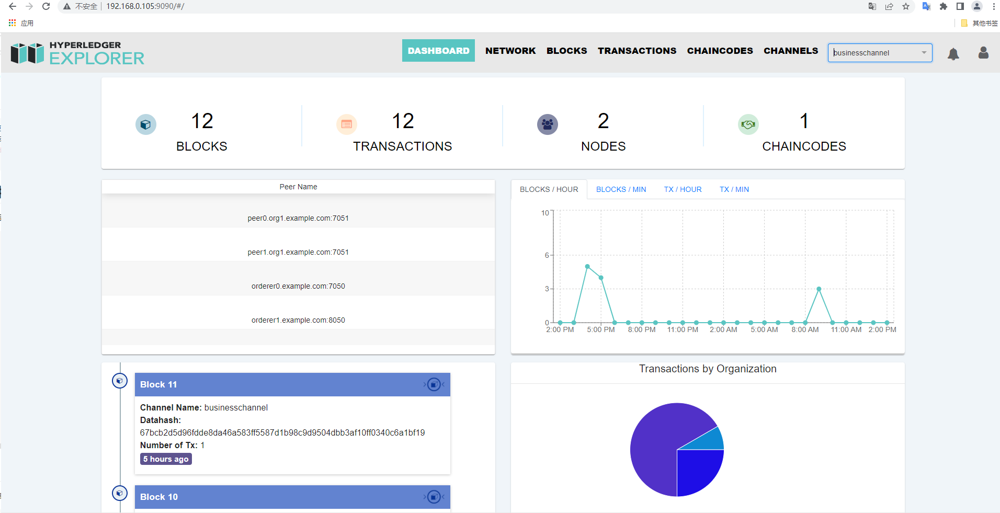

# 部署 Hyperledger Explorer 超级账本浏览器

> Hyperledger Explorer是一个简单、强大、易于使用、维护良好的开源工具，可以浏览底层区块链网络上的活动。
项目地址：https://github.com/hyperledger/blockchain-explorer

## 编写 fabric 网络连接配置文件

该连接配置文件要根据我们的网络拓扑结构进行编写。

```
{
  "name": "prod-network",
  "version": "1.0.0",
  "client": {
    "tlsEnable": true,
    "adminCredential": {
      "id": "exploreradmin",
      "password": "exploreradminpw"
    },
    "enableAuthentication": true,
    "organization": "Org1",
    "connection": {
      "timeout": {
        "peer": {
          "endorser": "300"
        },
        "orderer": "300"
      }
    }
  },
  "channels": {
    "businesschannel": {
      "peers": {
        "peer0.org1.example.com": {
          "endorsingPeer": true,
          "chaincodeQuery": true,
          "ledgerQuery": true,
          "eventSource": true
        },
        "peer1.org1.example.com": {
          "endorsingPeer": true,
          "chaincodeQuery": true,
          "ledgerQuery": true,
          "eventSource": true
        },
        "peer0.org2.example.com": {
          "endorsingPeer": true,
          "chaincodeQuery": true,
          "ledgerQuery": true,
          "eventSource": true
        },
        "peer1.org2.example.com": {
          "endorsingPeer": true,
          "chaincodeQuery": true,
          "ledgerQuery": true,
          "eventSource": true
        }
      }
    }
  },
  "organizations": {
    "Org1": {
      "mspid": "Org1MSP",
      "peers": [
        "peer0.org1.example.com",
        "peer1.org1.example.com"
      ],
      "adminPrivateKey": {
        "path": "/tmp/crypto/peerOrganizations/org1.example.com/users/User1@org1.example.com/msp/keystore/priv_sk"
      },
      "signedCert": {
        "path": "/tmp/crypto/peerOrganizations/org1.example.com/users/User1@org1.example.com/msp/signcerts/User1@org1.example.com-cert.pem"
      }
    },
    "Org2": {
      "mspid": "Org2MSP",
      "peers": [
        "peer0.org2.example.com",
        "peer1.org2.example.com"
      ],
      "adminPrivateKey": {
        "path": "/tmp/crypto/prod-network/peerOrganizations/org2.example.com/users/Admin@org2.example.com/msp/keystore/priv_sk"
      },
      "signedCert": {
        "path": "/tmp/crypto/peerOrganizations/org2.example.com/users/User1@org2.example.com/msp/signcerts/User1@org2.example.com-cert.pem"
      }
    }
  },
  "peers": {
    "peer0.org1.example.com": {
      "url": "grpcs://peer0.org1.example.com:7051",
      "grpcOptions": {
        "ssl-target-name-override": "peer0.org1.example.com",
        "hostnameOverride": "peer0.org1.example.com",
        "request-timeout": 120001
      },
      "tlsCACerts": {
        "path": "/tmp/crypto/peerOrganizations/org1.example.com/peers/peer0.org1.example.com/tls/ca.crt"
      }
    },
    "peer1.org1.example.com": {
      "url": "grpcs://peer1.org1.example.com:8051",
      "grpcOptions": {
        "ssl-target-name-override": "peer1.org1.example.com",
        "hostnameOverride": "peer1.org1.example.com",
        "request-timeout": 120001
      },
      "tlsCACerts": {
        "path": "/tmp/crypto/peerOrganizations/org1.example.com/peers/peer1.org1.example.com/tls/ca.crt"
      }
    },
    "peer0.org2.example.com": {
      "url": "grpcs://peer0.org2.example.com:7051",
      "grpcOptions": {
        "ssl-target-name-override": "peer0.org2.example.com",
        "hostnameOverride": "peer0.org2.example.com",
        "request-timeout": 120001
      },
      "tlsCACerts": {
        "path": "/tmp/crypto/peerOrganizations/org2.example.com/peers/peer0.org2.example.com/tls/ca.crt"
      }
    },
    "peer1.org2.example.com": {
      "url": "grpcs://peer1.org2.example.com:8051",
      "grpcOptions": {
        "ssl-target-name-override": "peer1.org2.example.com",
        "hostnameOverride": "peer1.org2.example.com",
        "request-timeout": 120001
      },
      "tlsCACerts": {
        "path": "/tmp/crypto/peerOrganizations/org2.example.com/peers/peer1.org2.example.com/tls/ca.crt"
      }
    }
  }
}
```

## 编写 `config.json` 配置文件

这个配置文件用来指定 fabric 网络连接配置文件的路径。

```

{
        "network-configs": {
                "prod-network": {
                        "name": "Prod Network",
                        "profile": "./connection-profile/org1ProdNetworkConnection.json"
                }
        },
        "license": "Apache-2.0"
}

```

## 编写 docker-compose 文件

`docker-compose-explorer.yaml`:

```

version: '2.0'


volumes:
    pgdata:
    walletstore:

services:

    explorerdb.mynetwork.com:
        image: hyperledger/explorer-db:latest
        container_name: explorerdb.mynetwork.com
        hostname: explorerdb.mynetwork.com
        ports:
            - 5432:5432
        environment:
            - DATABASE_DATABASE=fabricexplorer
            - DATABASE_USERNAME=hppoc
            - DATABASE_PASSWORD=password
        healthcheck:
            test: "pg_isready -h localhost -p 5432 -q -U postgres"
            interval: 30s
            timeout: 10s
            retries: 5
        volumes:
            - pgdata:/var/lib/postgresql/data


    explorer.mynetwork.com:
        image: hyperledger/explorer:latest
        container_name: explorer.mynetwork.com
        hostname: explorer.mynetwork.com
        ports:
            - 9090:8080
        extra_hosts:
            - "explorerdb.mynetwork.com:192.168.0.105"
            - "orderer0.example.com:192.168.0.105"
            - "orderer1.example.com:192.168.0.105"
            - "orderer2.example.com:192.168.0.105"
            - "peer0.org1.example.com:192.168.0.109"
            - "peer1.org1.example.com:192.168.0.109"
            - "peer0.org2.example.com:192.168.0.110"
            - "peer1.org2.example.com:192.168.0.110"
        environment:
            - DATABASE_HOST=explorerdb.mynetwork.com
            - DATABASE_DATABASE=fabricexplorer
            - DATABASE_USERNAME=hppoc
            - DATABASE_PASSWD=password
            - LOG_LEVEL_APP=debug
            - LOG_LEVEL_DB=info
            - LOG_LEVEL_CONSOLE=debug
            - LOG_CONSOLE_STDOUT=true
            - DISCOVERY_AS_LOCALHOST=false
        volumes:
            - ./config.json:/opt/explorer/app/platform/fabric/config.json
            - ./connection-profile:/opt/explorer/app/platform/fabric/connection-profile
            - ../crypto-config:/tmp/crypto
            - walletstore:/opt/explorer/wallet
        depends_on:
            explorerdb.mynetwork.com:
                condition: service_healthy
```


这些文件都准备好了后目录结构如下：
```
hyperledger-explorer/
├── config.json
├── connection-profile
│   └── org1ProdNetworkConnection.json
└── docker-compose-explorer.yaml
```

启动 Hyperledger Explorer：

```
docker-compose -f docker-compose-explorer.yaml up -d
```

清理（不删除持久性数据）：

```
docker-compose -f docker-compose-explorer.yaml down
```

彻底清理：

```
docker-compose -f docker-compose-explorer.yaml down -v
```

启动后访问 `http://localhost:9090/`:

